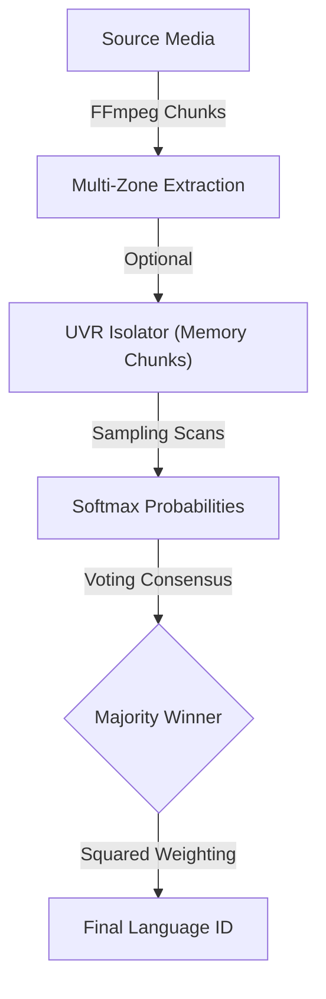
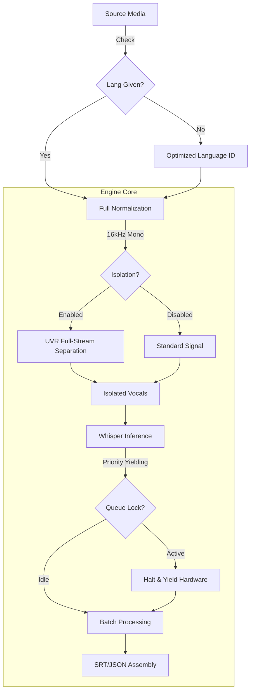

# Whisper Pro ASR


**Whisper Pro ASR** is a high-performance transcription microservice optimized for the **Whisper Large V3** model. It delivers enterprise-grade performance with native hardware acceleration for **Intel Core Ultra NPUs**, **Integrated GPUs**, and **NVIDIA CUDA** environments.

Engineered for seamless integration with **Bazarr** and the broader media automation stack, it offloads computationally intensive AI tasks from your primary system resources, providing industrial-strength transcription with rapid hardware context switching.

---

## ⚡ Quick Start

Deploy instantly using standard `docker-compose.yml`:

```yaml
services:
  whisper-asr:
    image: ventura8/whisper-pro-asr:latest
    container_name: whisper-asr
    ports:
      - "9000:9000"
    volumes:
      - ./model_cache:/app/model_cache
    restart: unless-stopped

    # 1. Intel Silicon (NPU/GPU)
    # devices:
    #   - /dev/dri:/dev/dri # Intel iGPU / Arc
    #   - /dev/accel/accel0:/dev/accel/accel0 # Intel NPU
    #   - /dev/dxg:/dev/dxg # Windows/WSL2 GPU mapping

    # 2. NVIDIA Silicon (CUDA)
    # Note: Requires NVIDIA Container Toolkit on the HOST for driver passthrough.
    # deploy:
    #   resources:
    #     reservations:
    #       devices:
    #         - driver: nvidia
    #           count: 1
    #           capabilities: [ gpu ]
```

1. Save the configuration.
2. Launch: `docker compose up -d`

> [!TIP]
> **Autonomous Hardware Resolution**: The engine automatically detects and adapts to your specific hardware (NVIDIA, Intel NPU, or Integrated GPU), optimizing the processing pipeline without requiring manual intervention.

## 🚀 Key Features

### Precision Architecture
- **Multi-Backend Support**: Specialized optimization profiles for **NVIDIA CUDA** and **Generic CPU** runtimes.
- **Dynamic Context Switching**: Effortlessly shifts workloads between disparate accelerators (e.g., performing vocal isolation on an Intel iGPU/NPU while transcribing via CPU).
- **FFmpeg 8.0.1 (Huffman)**: Core integration of the latest FFmpeg static builds featuring optimized Huffman coding and intelligent core utilization.

### Advanced Intelligence
- **Zero-Latency Pre-emption**: High-priority operations (such as language detection) instantly pause long-running transcription batches, ensuring immediate API responsiveness.
- **Studio-Grade Vocal Isolation**: Integrated **UVR/MDX-NET** engine for removal of background noise, music, and ambient artifacts prior to processing.
- **Probabilistic Language ID**: Utilizes **Squared Confidence Weighting** across strategic audio zones for robust identification.
- **Chunked-Bypass Extraction**: Bypasses full-file normalization for metadata tasks by extracting context zones directly from source media containers using FFmpeg.
- **Smart Signal Sampling**: Optional iterative search logic to pinpoint active speech in complex media files with extended periods of silence.

### Production Ready
- **OpenAI Standard API**: Drop-in compatible with the OpenAI whisper specification, allowing immediate integration with existing clients.
- **Interactive Documentation**: Full OpenAPI/Swagger interface available at `/docs` for testing and endpoint exploration.
- **Industrial Telemetry**: Real-time progress monitoring, including transcription speed multipliers (e.g., 25.0x), ETA calculation, and detailed hardware state reporting.
- **Bazarr Optimized**: Purpose-built for high-volume subtitle automation with stable SRT, VTT, and verbose JSON output formats. Fully compatible with `whisper-asr-webservice` API.

---

## Architecture & Workflows

### Signal Processing Pipeline
#### Flow: Language Identification (/detect-language)


#### Flow: Automated Speech Recognition (/asr)


### System Interaction

```mermaid
sequenceDiagram
    participant Client
    participant Flask as API Server
    participant Manager as Task Manager
    participant XPU as Hardware (NPU/GPU)
    
    rect rgb(20, 20, 30)
    Note over Client, XPU: Scenario A: Batch Transcription (/asr)
    Client->>Flask: POST /asr
    Flask->>Manager: Enqueue Session
    opt Language Missing
        Manager->>XPU: Detect Language (Source Chunks)
    end
    Manager->>Flask: Normalize Full Media
    opt Vocal Separation
        Manager->>XPU: UVR Isolation (VRAM)
    end
    loop Inference Cycle
        Manager->>XPU: Whisper Batch
        XPU-->>Manager: Prediction Data
        opt Preemption
            Note right of Manager: Pause for Priority Tasks
        end
    end
    Manager-->>Flask: Compiled Result
    Flask-->>Client: 200 OK (SRT/JSON)
    end

    rect rgb(30, 20, 20)
    Note over Client, XPU: Scenario B: Priority Identification (/detect-language)
    Client->>Flask: POST /detect-language
    Flask->>Manager: Acquire System Lock
    Note over Manager: Global yielding of batch tasks
    Manager->>Flask: Extract FFmpeg Chunks
    Manager->>XPU: Inference Scans (Single Worker)
    XPU-->>Manager: Accuracy Map
    Manager-->>Flask: High-Confidence ID (Optimized)
    Flask-->>Client: 200 OK (JSON)
    end
```


---

## Prerequisites
- **Silicon**: Any CPU or Intel GPU/NPU or NVIDIA Pascal+ GPU.
- **Environment**: Docker Engine 20.10+ / Docker Desktop.
- **NPU Requirements**: Latest Intel NPU driver package (NPU Plugin).

## Configuration Reference

The service is highly tunable via environment variables in `docker-compose.yml`.

| Variable | Default | Purpose |
| :--- | :--- | :--- |
| **Runtime Control** | | |
| `ASR_DEVICE` | `AUTO` | Inference target: `AUTO`, `CUDA`, or `CPU`. |
| `ASR_PREPROCESS_DEVICE` | `AUTO` | Inference target: `AUTO`, `NPU`, `GPU`, or `CPU`. |
| `ASR_MODEL` | `Systran/faster-whisper-large-v3` | Model ID (HuggingFace) or local path. |
| `VOCAL_SEPARATION_MODEL` | `UVR-MDX-NET-Voc_FT` | Model ID (HuggingFace) or local path |
| `ASR_BATCH_SIZE` | `1` | Number of segments processed per pass. |
| `ASR_BEAM_SIZE` | `5` | Decoding beam width (Search depth). |
| `DEBUG` | `false` | Enables verbose stack traces and debug logging. |
| **Optimization** | | |
| `OV_PERFORMANCE_HINT` | `LATENCY` | OpenVINO scheduling hint (Latency/Throughput). |
| `OV_CACHE_DIR` | `./model_cache` | Persistent directory for compiled hardware blobs. |
| **Parallelism** | | |
| `ASR_THREADS` | `4` | CPU core allocation for inference orchestration. |
| `ASR_PREPROCESS_THREADS` | `4` | CPU core allocation for UVR/ONNX preprocessing. |
| `FFMPEG_THREADS` | `0` | FFmpeg core limit (`0` for system-wide auto-detect). |
| **Preprocessing** | | |
| `ENABLE_VOCAL_SEPARATION`| `true` | Toggles UVR background removal engine for translate/transcribe. |
| `ENABLE_LD_PREPROCESSING`| `true` | Toggles UVR background removal engine for language detection. |
| `SMART_SAMPLING_SEARCH` | `false` | Enables localized signal searching in sparse audio. |

---

## 📜 Full `docker-compose.yml` Example
 
For an exhaustive deployment featuring all optimization toggles and hardware passthrough options:
 
```yaml
services:
  whisper-pro-asr:
    image: ventura8/whisper-pro-asr:latest
    container_name: whisper-pro-asr
    restart: unless-stopped
    ports:
      - "9000:9000"
 
    # --- [HARDWARE ACCELERATION] ---
    # The application performs automated detection of both Intel and NVIDIA hardware.
    # To enable hardware passthrough, uncomment the appropriate sections below.
 
    # 1. Intel Silicon (iGPU / NPU) - Used for Preprocessing
    # devices:
    #   - /dev/dri:/dev/dri # Integrated GPU
    #   - /dev/accel/accel0:/dev/accel/accel0 # Meteor/Lunar Lake NPU
    #   - /dev/dxg:/dev/dxg # Windows/WSL2 GPU mapping
 
    # 2. NVIDIA Silicon (CUDA)
    # Note: Requires NVIDIA Container Toolkit on the HOST for driver passthrough.
    # deploy:
    #   resources:
    #     reservations:
    #       devices:
    #         - driver: nvidia
    #           count: 1
    #           capabilities: [gpu]
 
    environment:
      - DEBUG=false
 
      # --- [ENGINE CONFIGURATION] ---
      # Hardware Target: AUTO (Automated detection), CUDA (NVIDIA), CPU
      - ASR_DEVICE=AUTO
      # Computation Precision: AUTO, int8, float16 (default: AUTO)
      - ASR_COMPUTE_TYPE=AUTO
      # Model Weight Source (Faster-Whisper ID or local path)
      - ASR_MODEL=Systran/faster-whisper-large-v3
 
      # --- [INFERENCE PARAMETERS] ---
      # Generation Search Breadth (Higher = more accurate, lower = faster)
      - ASR_BEAM_SIZE=5
      # Parallel segment batching (1 is recommended for single-GPU/NPU stability)
      - ASR_BATCH_SIZE=1
 
      # --- [PREPROCESSING (UVR / MDX-NET)] ---
      # Target Device: AUTO, CPU, CUDA (NVIDIA), GPU (Intel), NPU (Intel)
      - ASR_PREPROCESS_DEVICE=AUTO
      # Isolation Model Filename
      - VOCAL_SEPARATION_MODEL=UVR-MDX-NET-Inst_HQ_3.onnx
      # Vocal Separation Logic Toggles
      - ENABLE_VOCAL_SEPARATION=true
      - ENABLE_LD_PREPROCESSING=true
      - SMART_SAMPLING_SEARCH=false
 
      # --- [RESOURCE ALLOCATION] ---
      # Core limit for Whisper ASR logic
      - ASR_THREADS=4
      # Core limit for Preprocessing (ONNX Runtime)
      - ASR_PREPROCESS_THREADS=4
      # Core limit for Media Normalization (0 = auto-detect system-wide)
      - FFMPEG_THREADS=4
 
    volumes:
      # Persistent cache for AI models and pre-compiled hardware binaries (NPU)
      - ./model_cache:/app/model_cache
      # Recommended: Map your media volumes to enable instant (0-copy) local processing
      # The service will prioritize reading these files directly over network uploads.
      - /path/to/my/media:/media
      - /mnt/nas/tv:/tv
      - /mnt/nas/movies:/movies
```
 
---
 
## API Reference

Comprehensive Swagger documentation is hosted at **`/docs`**.

### 1. Identify Language
**POST** `/detect-language`  
Performs multi-zone analysis to identify source language metadata. Returns full language names (e.g., "English") for Bazarr compatibility.

### 2. Transcribe Media
**POST** `/asr`  
**POST** `/v1/audio/transcriptions`  
Main entry point for generating subtitles.
- **Formats**: `srt` (default), `vtt`, `txt`, `tsv`, `json` (with segments).
- **Optimization**: Prioritizes local file access if the path exists (via volume mapping), otherwise accepts file uploads.

### 3. Service Analytics
**GET** `/status`  
Health-check endpoint returning model metadata, hardware status, and versioning information.

---

## 📺 Bazarr Configuration

To use this service with **Bazarr**:

1.  **Provider**: Choose **Whisper** (or `whisper-asr-webservice`).
2.  **Endpoint**: `http://<YOUR_DOCKER_IP>:9000`
3.  **Timeouts**: Should be set very high (54000) for long movies
4.  **Pass video filename to Whisper**: Should be enabled for volume mapping to work correctly
3.  **Volume Mapping (Highly Recommended)**:
    - Ensure your Bazarr and Whisper-Pro-ASR containers share the same media paths (e.g., both map `/tv` to the same actual folder).
    - When configured this way, Bazarr sends the *file path* to Whisper. Whisper Pro checks if it can read that path locally. If yes, it processes the file instantly without network overhead.
    - If paths don't match, Whisper Pro automatically falls back to handling the full file upload from Bazarr.

---

## Performance Notes
- **Golden Configuration**: We recommend **Large-V3** with **Batch=1** and **Beam=5** for the majority of CPU/GPU workloads.
- **VRAM/RAM Requirements**: Ensure at least **16GB of System RAM** when running both Vocal Isolation and Large-V3.
- **NPU Stability**: If you encounter timeouts or hangs on Intel NPU, reduce `ASR_BEAM_SIZE` to `3` or `4` to lighten the computation graph.

---

## 🛠 Project Structure
```text
/
├── whisper_server.py        # Master entry point
├── modules/                 # Service Logic
│   ├── model_manager.py     # Inference & Execution
│   ├── preprocessing.py     # UVR Isolation Logic
│   ├── routes.py            # API Implementation
│   └── ...                  # Utilities & Configuration
├── Dockerfile               # Packaging Definition
└── docker-compose.yml       # Orchestration Template
```
