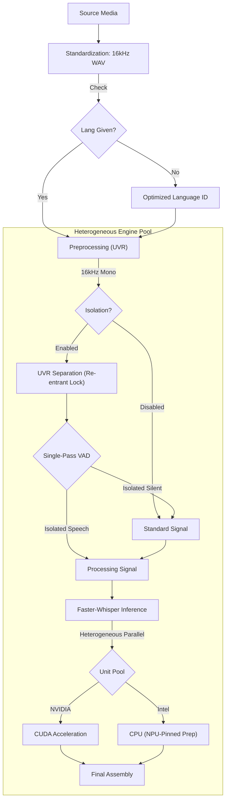
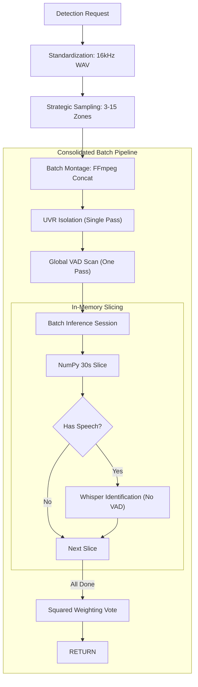

# Technical Architecture

Whisper Pro v1.0.4 implements a **Heterogeneous Model Pool** architecture designed to extract maximum performance from modern hybrid silicon (Intel Meteor Lake, NVIDIA RTX).

## 🧬 Module Ecosystem

| Component | Responsibility |
|:---|:---|
| `config.py` | Centralized hardware detection (CUDA/NPU/iGPU) and unit pool initialization. |
| `logging_setup.py` | Orchestrates hardware banners and thread-local context filtering. |
| `model_manager.py` | Manages the **Unit Pool**, model instance lifecycles, and **Re-entrant Hardware Locks**. |
| `preprocessing.py` | Vocal isolation engine with unit-specific context pinning. |
| `routes.py` | Flask API layer implementing RESTful endpoints and OpenAI-compatible aliases. |
| `language_detection.py` | Multi-zone strategic sampling with **Global VAD** and batch inference. |
| `utils.py` | Managed FFmpeg normalization and **16kHz WAV Standardization**. |
| `vad.py` | Silero Voice Activity Detection (VAD) optimized for batch in-memory buffers. |

### 🧩 Hardware Compatibility Matrix
| Pipeline Stage | CPU (Generic) | NVIDIA (CUDA) | Intel iGPU / Arc | Intel NPU |
| :--- | :---: | :---: | :---: | :---: |
| **Media Standardization** | ✅ | ✅ | ✅ | ✅ |
| **Vocal Isolation (UVR)** | ✅ | ✅ | ✅ (OpenVINO) | ✅ (OpenVINO) |
| **VAD Verification** | ✅ | ✅ | ✅ | ✅ |
| **Whisper ASR Inference** | ✅ | ✅ | ⚠️ (CPU Fallback) | ⚠️ (CPU Fallback) |

---

## 🏎 Processing Pipelines

### Transcription Flow (/asr)

### Priority Detection Flow (/detect-language)

---

## 🔒 Granular Resource Orchestration

### 1. Re-entrant Hardware Locks
The system implements a **Thread-Local Re-entrant Locking Pattern** via `model_lock_ctx()`. This allows a high-level task (like a full transcription request) to "claim" a hardware unit once and share it across all internal sub-stages:
1.  **Vocal Isolation (UVR)**
2.  **Language Identification (Whisper)**
3.  **ASR Transcription (Whisper)**

This prevents deadlocks where a task might release a unit between stages and be unable to reclaim it due to high queue volume.

### 2. SSD Write Protection (Deferred Persistence)
To prevent hardware wear on SSD-based deployments, the system utilizes a **Dual-Path Persistence Engine**:
- **Transient State**: Telemetry snapshots and real-time logs are stored in `STATE_DIR` (RAM-disk).
- **Persistent Audit**: Task history is managed in a RAM cache and only flushed to the physical `task_history.json` on the SSD every 10 tasks or 1 hour.

---

## 🏛 Hardware Interface & Host Dependencies

- **Intel NPU/GPU**: Leverages `/dev/dri` and `/dev/accel` nodes.
- **NVIDIA CUDA**: Requires the **NVIDIA Container Toolkit** on the host.
- **SSD Optimization**: All transient I/O is redirected to a RAM-backed `tmpfs` volume to prevent physical wear.
- **Standardization Layer**: All incoming media (MKV, AVI, MP4, etc.) is standardized to 16kHz Mono WAV before entering the pipeline, ensuring consistent results across all formats.
