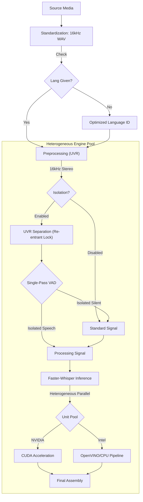
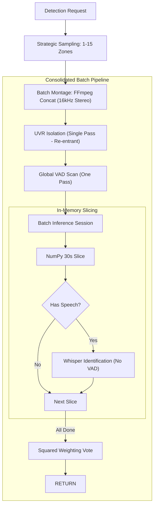

# Technical Architecture

Whisper Pro v1.0.5 implements a **Heterogeneous Model Pool** architecture designed to extract maximum performance from modern hybrid silicon (Intel Meteor Lake, NVIDIA RTX).

## 🧬 Module Ecosystem

| Component | Responsibility |
|:---|:---|
| `modules/config.py` | Centralized hardware detection (CUDA/NPU/iGPU) and unit pool initialization. |
| `modules/logging_setup.py` | Orchestrates hardware banners and thread-local context filtering. |
| `modules/inference/` | Core logic for `model_manager`, `scheduler` (re-entrant locks), `preprocessing` (UVR), `vad`, and `intel_engine`. |
| `modules/api/` | Flask API layer implementing `routes_asr`, `routes_detect`, and `routes_system`. |
| `modules/monitoring/` | `dashboard`, `telemetry`, and `metrics_discovery` for real-time observability. |
| `modules/utils.py` | Managed FFmpeg normalization and **16kHz WAV Standardization**. |

### 🧩 Hardware Compatibility Matrix
| Pipeline Stage | CPU (Generic) | NVIDIA (CUDA) | Intel iGPU / Arc | Intel NPU |
| :--- | :---: | :---: | :---: | :---: |
| **Media Standardization** | ✅ | ✅ | ✅ | ✅ |
| **Vocal Isolation (UVR)** | ✅ | ✅ | ✅ (OpenVINO) | ✅ (OpenVINO) |
| **VAD Verification** | ✅ | ✅ | ✅ | ✅ |
| **Whisper ASR Inference** | ✅ | ✅ | ⚠️ (CPU Fallback) | ⚠️ (CPU Fallback) |

---

## 🏎 Processing Pipelines

### Transcription Flow (/asr)

### Priority Detection Flow (/detect-language)

---

## 🔒 Granular Resource Orchestration

### 1. Re-entrant Hardware Locks
The system implements a **Thread-Local Re-entrant Locking Pattern** via `model_lock_ctx()`. This allows a high-level task (like a full transcription request) to "claim" a hardware unit once and share it across all internal sub-stages:
1.  **Vocal Isolation (UVR)**
2.  **Language Identification (Whisper)**
3.  **ASR Transcription (Whisper)**

This prevents deadlocks where a task might release a unit between stages and be unable to reclaim it due to high queue volume.

### 2. Deadlock-Free Priority Resumption
The system utilizes a **Cooperative Yielding** pattern combined with an automated `release_priority` cleanup. High-priority tasks (like `/detect-language`) can signal active transcriptions to pause. Once the priority task completes, the `early_task_registration` context manager automatically triggers a system-wide resumption signal (`resume_event`), ensuring that paused tasks continue immediately exactly where they left off.

- **Centralized Storage Hygiene**: Implements a `tracked_files` registry within the thread context. Every transient file (uploaded media, standardized WAVs, HQ prepared files, and isolated stems) is registered upon creation. A mandatory `cleanup_files()` call in the request's `finally` block ensures a **100% deletion rate**, eliminating storage leaks even after fatal errors.

### 4. Real-time Observability Engine
The system features a thread-aware logging and telemetry engine designed for industrial reliability:
- **Hardened Diagnostic Logging**: Implements a persistent, idempotent logging architecture. The `whisper_pro.log` stream is guaranteed across application lifecycles via a hardened initialization sequence that survives global resets.
- **Thread-Isolated Buffers**: Utilizing a custom `TaskLogFilter`, logs are redirected to a thread-local buffer (`TASK_LOGS`) in real-time. This allows the dashboard to display execution logs specific to an active task without inter-thread noise.
- **Real-Time Synchronization**: The log download endpoint features a mandatory flush-to-disk sequence and zero-caching headers, ensuring diagnostics are always current.
- **Industrial Quality Standard**: The entire ecosystem is maintained at a **10.0/10 Pylint score**, representing a zero-regression baseline for enterprise deployments.
- **Incremental Dashboard Updates**: The monitoring UI utilizes an incremental DOM update pattern to maintain scroll positions in log buffers and live streams while polling the `/status` endpoint every 2 seconds.

---

## 🏛 Hardware Interface & Host Dependencies

- **Intel NPU/GPU**: Leverages `/dev/dri` and `/dev/accel` nodes.
- **NVIDIA CUDA**: Requires the **NVIDIA Container Toolkit** on the host.
- **SSD Optimization**: All transient I/O is redirected to a RAM-backed `tmpfs` volume to prevent physical wear.
- **Standardization Layer**: All incoming media (MKV, AVI, MP4, etc.) is standardized to 16kHz Mono WAV before entering the pipeline, ensuring consistent results across all formats.
