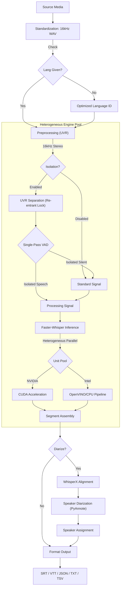
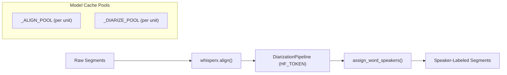
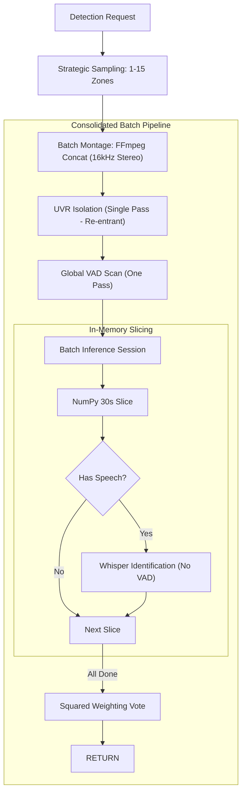
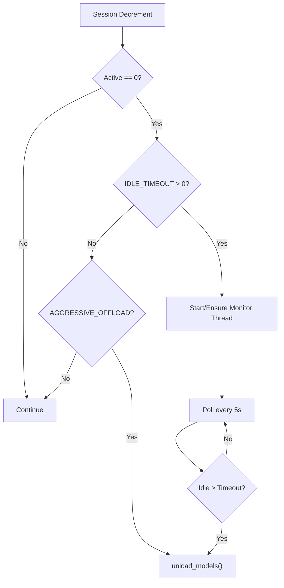

# Technical Architecture

Whisper Pro ASR implements a **Heterogeneous Model Pool** architecture designed to extract maximum performance from modern hybrid silicon (Intel Meteor Lake, NVIDIA RTX), with integrated speaker diarization and configurable model lifecycle management.

## 🧬 Module Ecosystem

| Component | Responsibility |
|:---|:---|
| `modules/bootstrap.py` | Hardware path patching and library redirection. Ensures correct hardware-optimized libraries are injected into `sys.path` before any AI modules are imported. |
| `modules/config.py` | Centralized hardware detection (CUDA/NPU/iGPU), unit pool initialization, and feature flags (`HF_TOKEN`, `MODEL_IDLE_TIMEOUT`, `INITIAL_PROMPT`). |
| `modules/logging_setup.py` | Orchestrates hardware banners and thread-local context filtering. |
| `modules/inference/` | Core logic for `model_manager` (transcription, diarization, idle monitoring), `scheduler` (re-entrant locks), `preprocessing` (UVR), `vad`, `language_detection` (batch language ID pipeline), and `intel_engine`. |
| `modules/api/` | Flask API layer: `routes_asr` (transcription), `routes_detect` (language detection), `routes_system` (dashboard, settings, analytics, history), and `routes_utils` (shared request utilities, file upload handling, cleanup). |
| `modules/monitoring/` | `dashboard` & `dashboard_ui` (Material Design UI), `analytics_ui` (analytics dashboard), `telemetry` & `telemetry_manager` (persistent telemetry history), `history_manager` (task history with dual-tier storage), and `metrics_discovery` (hardware metrics). |
| `modules/utils.py` | Managed FFmpeg normalization, **16kHz WAV Standardization**, subtitle generation with `_wrap_text()` layout control, and speaker label formatting. |

### 🧩 Hardware Compatibility Matrix
| Pipeline Stage | CPU (Generic) | NVIDIA (CUDA) | Intel iGPU / Arc | Intel NPU |
| :--- | :---: | :---: | :---: | :---: |
| **Media Standardization** | ✅ | ✅ | ✅ | ✅ |
| **Vocal Isolation (UVR)** | ✅ | ✅ | ✅ (OpenVINO) | ✅ (OpenVINO) |
| **VAD Verification** | ✅ | ✅ | ✅ | ✅ |
| **Whisper ASR Inference** | ✅ | ✅ | ⚠️ (CPU Fallback) | ⚠️ (CPU Fallback) |
| **Speaker Diarization** | ✅ | ✅ | ✅ | ✅ |

---

## 🏎 Processing Pipelines

### Transcription Flow (/asr)

### Speaker Diarization Pipeline

### Priority Detection Flow (/detect-language)

---

## 🔒 Granular Resource Orchestration

### 1. Re-entrant Hardware Locks
The system implements a **Thread-Local Re-entrant Locking Pattern** via `model_lock_ctx()`. This allows a high-level task (like a full transcription request) to "claim" a hardware unit once and share it across all internal sub-stages:
1.  **Vocal Isolation (UVR)**
2.  **Language Identification (Whisper)**
3.  **ASR Transcription (Whisper)**
4.  **Speaker Diarization (WhisperX)**

This prevents deadlocks where a task might release a unit between stages and be unable to reclaim it due to high queue volume.

### 2. Deadlock-Free Priority Resumption
The system utilizes a **Cooperative Yielding** pattern combined with an automated `release_priority` cleanup. High-priority tasks (like `/detect-language`) can signal active transcriptions to pause. As of v1.0.6, priority tasks are strictly serialized using `STATE.priority_sequential_lock` during the entire execution lifetime of the `early_task_registration` context manager. This prevents concurrent preemption races. Once the priority task completes, the context manager automatically triggers a system-wide resumption signal (`resume_event`), ensuring that paused tasks continue immediately exactly where they left off.

- **Standard Task Yielding**: Standard tasks yield resource acquisition and loop-sleep instead of blocking on the model lock semaphore whenever priority tasks are present in the registry, preventing priority starvation.
- **Priority Preemption Bypass**: Running priority tasks ignore preemption requests, preventing them from pausing themselves if multiple priority tasks are queued.
- **Preemption Visibility**: Preempted tasks temporarily transition to `"queued"` status with a `"Paused for Priority Task"` stage, ensuring they display in the dashboard queue.
- **FFmpeg Standardization Synchronization**: Priority tasks dynamically yield to active standard FFmpeg processes. Using the public condition variable `STANDARD_FFMPEG_COND` and count state `STANDARD_FFMPEG_STATE`, a priority language detection request blocks if a standard task is performing media standardization. It resumes immediately after FFmpeg completes, while the standard task yields resource acquisition before entering subsequent heavy vocal separation and model execution stages.
- **Centralized Storage Hygiene**: Implements a `tracked_files` registry within the thread context. Every transient file (uploaded media, standardized WAVs, HQ prepared files, and isolated stems) is registered upon creation. A mandatory `cleanup_files()` call in the request's `finally` block ensures a **100% deletion rate**, eliminating storage leaks even after fatal errors.

### 3. Model Lifecycle & Idle Timeout
The system supports two model lifecycle strategies, configured via environment variables:

| Strategy | Config | Behavior |
|:---|:---|:---|
| **Aggressive Offload** | `AGGRESSIVE_OFFLOAD=false` | Models are unloaded from memory immediately when active sessions drop to zero. |
| **Idle Timeout** | `MODEL_IDLE_TIMEOUT=300` (default) | A background daemon thread (`ModelIdleMonitor`) monitors inactivity. Models are only purged after the configured idle period (in seconds) elapses with zero active sessions. |

When `MODEL_IDLE_TIMEOUT > 0` (or defaults to `300`), it takes precedence over `AGGRESSIVE_OFFLOAD`. The monitor thread is started lazily on the first session decrement or model load.

### 4. Real-time Observability Engine
The system features a thread-aware logging and telemetry engine designed for industrial reliability:
- **Hardened Diagnostic Logging**: Implements a persistent, idempotent logging architecture. The `whisper_pro.log` stream is guaranteed across application lifecycles via a hardened initialization sequence that survives global resets.
- **Thread-Isolated Buffers**: Utilizing a custom `TaskLogFilter`, logs are redirected to a thread-local buffer (`TASK_LOGS`) in real-time. This allows the dashboard to display execution logs specific to an active task without inter-thread noise.
- **Real-Time Synchronization**: The log download endpoint features a mandatory flush-to-disk sequence and zero-caching headers, ensuring diagnostics are always current.
- **Telemetry Downsampling**: A dual-layer downsampling strategy caps telemetry data at 300 points for dashboard chart rendering. Server-side downsampling in `telemetry.py` reduces payloads before transmission, while client-side downsampling in `dashboard_ui.py` provides an additional safety net for chart performance.
- **Service Analytics**: The `/analytics` endpoint and dedicated analytics UI (`analytics_ui.py`) provide cumulative and daily breakdowns of task counts, durations, and usage patterns from persistent task history.
- **Industrial Quality Standard**: The entire ecosystem is maintained at a **10.0/10 Pylint score** and strict **>90% test coverage** across all modules, representing a zero-regression baseline for enterprise deployments.
- **Incremental Dashboard Updates**: The monitoring UI utilizes an incremental DOM update pattern to maintain scroll positions in log buffers and live streams while polling the `/status` endpoint every 2 seconds.

---

## 🏛 Hardware Interface & Host Dependencies

- **Intel NPU/GPU**: Leverages `/dev/dri` and `/dev/accel` nodes.
- **NVIDIA CUDA**: Requires the **NVIDIA Container Toolkit** on the host.
- **SSD Optimization**: All transient I/O is redirected to a RAM-backed `tmpfs` volume to prevent physical wear.
- **Standardization Layer**: All incoming media (MKV, AVI, MP4, etc.) is standardized to 16kHz Mono WAV before entering the pipeline, ensuring consistent results across all formats.
- **Diarization Models**: WhisperX alignment and PyAnnote diarization models are cached per hardware unit in `_ALIGN_POOL` and `_DIARIZE_POOL`. These are purged alongside Whisper models during `unload_models()`.
