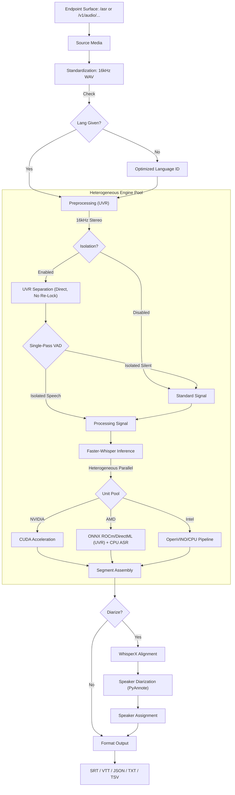
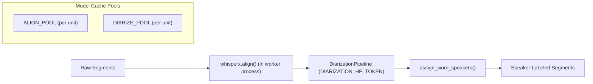
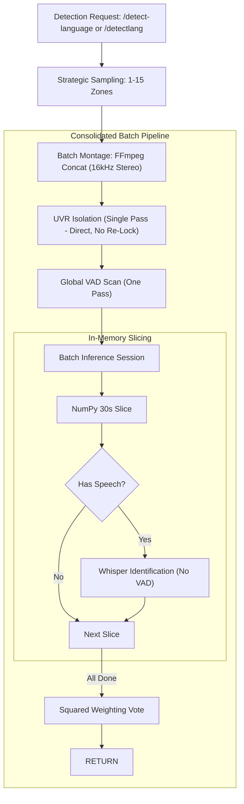
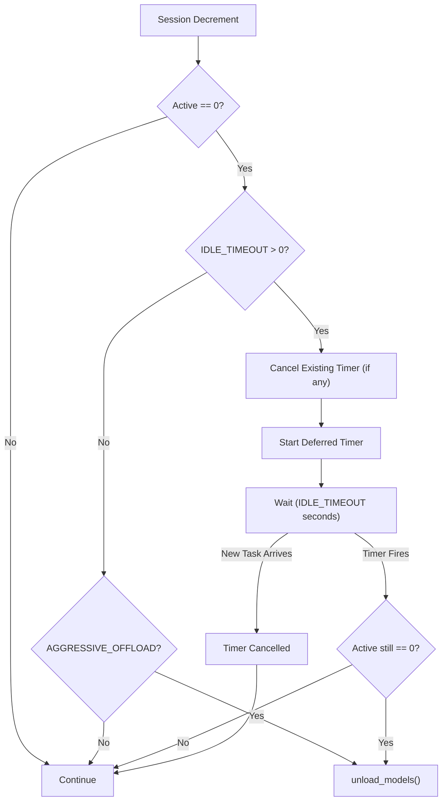

# Technical Architecture

Whisper Pro ASR implements a **Heterogeneous Model Pool** architecture designed to extract maximum performance from modern hybrid silicon (Intel Meteor Lake, NVIDIA RTX, AMD Radeon), with integrated speaker diarization and configurable model lifecycle management.

## Concurrency Priority Policy

The architecture is concurrency-first: deadlock/livelock safety and bounded progress are treated as hard requirements.

- Throughput optimizations cannot weaken lock-safety or liveness guarantees.
- Priority/preemption pathways use indefinite waiting semantics under saturation; queued work must wait instead of failing on scheduler timeout.
- Scheduler changes must preserve documented lock-order constraints and be validated with liveness regression tests.

## 🧬 Module Ecosystem

### Core Runtime Modules (`modules/core/`)

All core runtime modules are consolidated under `modules/core/` for improved organization and import clarity:

| Component | Responsibility |
| :--- | :--- |
| `modules/core/bootstrap.py` | Hardware path patching and library redirection. Ensures correct hardware-optimized libraries are injected into `sys.path` before any AI modules are imported. |
| `modules/core/config.py` | Centralized hardware detection (CUDA/NPU/iGPU), unit pool initialization, and feature flags (`DIARIZATION_HF_TOKEN`, `MODEL_IDLE_TIMEOUT`, `INITIAL_PROMPT`). |
| `modules/core/logging_setup.py` | Orchestrates hardware banners and thread-local context filtering. |
| `modules/core/constants.py` | Static constants such as `HALLUCINATION_PHRASES` used across the codebase. |
| `modules/core/utils.py` | Managed FFmpeg normalization, **16kHz WAV Standardization**, subtitle generation with `wrap_text()` layout control, speaker label formatting, and cross-platform utilities. |
| `modules/core/subtitles.py` | Subtitle format generation (SRT, VTT, TSV, TXT) with text wrapping, speaker labels, and layout customization. |

### Application Modules

| Component | Responsibility |
| :--- | :--- |
| `modules/inference/` | Inference stack grouped by concern: `runtime/` (`model_manager`, `concurrency`, segment consumption), `scheduler/` (nesting-safe locking via non-locking "_direct" sub-stage entry points, state/order/task helpers), `pipeline/` (`preprocessing/` package with orchestrator in `__init__.py` plus `helpers.py`, `provider.py`, `execution.py`, alongside `vad`, `language_detection`, `diarization`, `post_processing`), and `engines/` (`base`, `engine_factory`, `faster_whisper_engine`, `openai_whisper_engine`, `whisperx_engine`, `intel_engine`). |
| `modules/api/` | FastAPI application layer grouped by concern: `routes/` (`asr`, `detect`, `system`) and `support/` (`request_utils`, `upload_extraction`, `local_path`, `security`) for shared request/materialization/path-approval/security logic. |
| `modules/monitoring/` | `dashboard` & `dashboard_ui` (Material Design UI renderer loading manifest-ordered modules from `templates/dashboard_js_files.txt`), `analytics_ui` (analytics dashboard loaded from `templates/analytics_js_files.txt`), `telemetry` & `telemetry_manager` (persistent telemetry history), `history_manager` (task history with dual-tier storage), and `metrics_discovery` (hardware metrics). |

### 🧩 Hardware Compatibility Matrix

| Pipeline Stage | CPU (Generic) | NVIDIA (CUDA) | AMD (ROCm/DirectML) | Intel iGPU / Arc | Intel NPU |
| :--- | :---: | :---: | :---: | :---: | :---: |
| **Media Standardization** | ✅ | ✅ | ✅ | ✅ | ✅ |
| **Vocal Isolation (UVR)** | ✅ | ✅ | ✅ (ONNX ROCm on native Linux `/dev/kfd`; DirectML on Windows host only — not inside Linux Docker/WSL2) | ✅ (OpenVINO) | ✅ (OpenVINO) |
| **VAD Verification** | ✅ | ✅ | ✅ | ✅ | ✅ |
| **Whisper ASR Inference** | ✅ | ✅ | ⚠️ (CPU Fallback) | ⚠️ (CPU Fallback) | ⚠️ (CPU Fallback) |
| **Speaker Diarization** | ✅ | ✅ | ✅ | ✅ | ✅ |

---

## 🏎 Processing Pipelines

### Transcription Flow (/asr)


```mermaid
graph TD
    EP["Endpoint Surface: /asr or /v1/audio/..."] --> A["Source Media"]
    A --> STD["Standardization: 16kHz WAV"]
    STD -->|Check| L{"Lang Given?"}
    L -->|No| LD["Optimized Language ID"]
    L -->|Yes| PRE["Preprocessing (UVR)"]
    LD --> PRE
    
    subgraph CORE ["Heterogeneous Engine Pool"]
    PRE -->|16kHz Stereo| C{"Isolation?"}
    C -->|Enabled| D["UVR Separation (Direct, No Re-Lock)"]
    C -->|Disabled| E["Standard Signal"]
    
    D --> VAD{"Single-Pass VAD"}
    VAD -->|Isolated Silent| E
    VAD -->|Isolated Speech| F["Processing Signal"]
    E --> F
    
    F --> G["Faster-Whisper Inference"]
    G -->|Heterogeneous Parallel| H{"Unit Pool"}
    H -->|NVIDIA| I["CUDA Acceleration"]
    H -->|AMD| AMD["ONNX ROCm/DirectML (UVR) + CPU ASR"]
    H -->|Intel| J["OpenVINO/CPU Pipeline"]
    I --> K["Segment Assembly"]
    AMD --> K
    J --> K
    end

    K --> DIAR{"Diarize?"}
    DIAR -->|No| FMT["Format Output"]
    DIAR -->|Yes| ALIGN["WhisperX Alignment"]
    ALIGN --> SPEAK["Speaker Diarization (PyAnnote)"]
    SPEAK --> ASSIGN["Speaker Assignment"]
    ASSIGN --> FMT
    FMT --> OUT["SRT / VTT / JSON / TXT / TSV"]
```

### Speaker Diarization Pipeline


```mermaid
graph LR
    SEG["Raw Segments"] --> ALIGN["whisperx.align() (in worker process)"]
    ALIGN --> DIAR["DiarizationPipeline (DIARIZATION_HF_TOKEN)"]
    DIAR --> ASSIGN["assign_word_speakers()"]
    ASSIGN --> LABELED["Speaker-Labeled Segments"]
    
    subgraph CACHE ["Model Cache Pools"]
    AP["ALIGN_POOL (per unit)"]
    DP["DIARIZE_POOL (per unit)"]
    end
```

**WhisperX Process Isolation**: `whisperx` is not imported in the main service process. WhisperX 3.8.6 hard-pins a torch/torchaudio/torchvision/huggingface-hub stack that is incompatible with the versions the rest of the application uses, and that stack cannot be safely reloaded inside one live interpreter. `whisperx_engine.py` instead calls `whisperx_worker_client.call(...)` / `call_with_generation(...)`, which lazily spawns and owns a dedicated child process (`whisperx_worker.py`, launched via `multiprocessing.get_context("spawn")` against the isolated install at `WHISPERX_LIB_PATH`). Spawn re-imports app `__main__` as `__mp_main__`; `whisper_pro_asr.py` skips FastAPI/torch construction on that path, and `modules` / `modules.inference.engines` package inits stay lazy so importing `whisperx_worker` does not pull the main stack before `_activate_isolated_lib_path()` runs. `diarization.py` talks to alignment/diarization models through this client using opaque handles instead of live Python objects. `ALIGN_POOL`/`DIARIZE_POOL` still track per-unit handles in the main process; the underlying models live in the worker. Load paths that cache handles use `call_with_generation(...)`, which returns `(result, generation)` under the same `_LOCK` so the stamped generation cannot race a mid-load worker respawn. Parent-side access remains serialized under one shared `_LOCK` (a deliberate single-worker design for this isolation layer; concurrent WhisperX across distinct scheduler hardware units is not multiplexed yet). Callers that block beyond `WHISPERX_WORKER_LOCK_WARN_SEC` (default 5s) emit an operational warning identifying the waiting operation (`call`/`generation`/`shutdown`) without changing lock semantics. RPC deadlines are off by default (`WHISPERX_WORKER_CALL_TIMEOUT_SEC=0`); set a positive value only to enforce a hung-worker ceiling. The isolated install is pinned with hashes via `requirements/whisperx.lock.txt` (`pip install --require-hashes`) in the production Dockerfile. Releasing GPU/VRAM for these models (`unload_models()` / idle cleanup) shuts down and respawns the worker rather than just dropping references. A `WhisperXWorkerError` from the client falls back to unlabeled segments rather than failing the whole transcription.

### Priority Detection Flow (/detect-language)


```mermaid
graph TD
    START["Detection Request: /detect-language or /detectlang"] --> SAMPLING["Strategic Sampling: 1-15 Zones"]
    SAMPLING --> MONTAGE["Batch Montage: FFmpeg Concat (16kHz Stereo)"]
    
    subgraph BATCH ["Consolidated Batch Pipeline"]
    MONTAGE --> ISOLATE["UVR Isolation (Single Pass - Direct, No Re-Lock)"]
    ISOLATE --> VAD["Global VAD Scan (One Pass)"]
    VAD --> BATCH_INF["Batch Inference Session"]
    
    subgraph LOOP ["In-Memory Slicing"]
    BATCH_INF --> SLICE["NumPy 30s Slice"]
    SLICE --> SPEECH{"Has Speech?"}
    SPEECH -->|Yes| ID["Whisper Identification (No VAD)"]
    SPEECH -->|No| NEXT["Next Slice"]
    ID --> NEXT
    end
    
    NEXT -->|All Done| VOTE["Squared Weighting Vote"]
    VOTE --> RETURN
    end
```

---

## 🔒 Granular Resource Orchestration

### 1. Nesting-Safe Hardware Locks

The system avoids re-locking during nested sub-stages structurally rather than through a reentrant lock: a high-level task (like a full transcription request) claims a hardware unit once via `model_lock_ctx()` (gated by a single global `threading.Semaphore(accel_limit)` that bounds total concurrent hardware claims; which *specific* unit is assigned comes from `STATE.hw_pool`, a separate FIFO queue of hardware-unit entries), and internal sub-stages call dedicated non-locking "_direct" entry points (e.g. `run_vocal_isolation_direct`, `run_batch_language_detection_direct`, `run_language_detection_core`) that skip acquisition entirely, so the already-claimed unit is shared across:

1. **Vocal Isolation (UVR)**
2. **Language Identification (Whisper)**
3. **ASR Transcription (Whisper)**
4. **Speaker Diarization (WhisperX)**

This prevents deadlocks where a task might release a unit between stages and be unable to reclaim it due to high queue volume, without requiring the lock itself to support reentry.

### 2. Deadlock-Free Priority Resumption

The system utilizes a **Cooperative Yielding** pattern combined with an automated `release_priority` cleanup. High-priority tasks (like `/detect-language`) can signal active transcriptions to pause. Priority tasks are not globally serialized and may run in parallel across multiple available/borrowed units, while same-priority FIFO ordering is preserved at acquisition boundaries. Once a priority task completes, the context manager automatically triggers unit-scoped resumption signaling, ensuring paused tasks continue exactly where they left off.

- **Standard Task Yielding**: Standard tasks yield resource acquisition and loop-sleep instead of blocking on the model lock semaphore whenever priority tasks are present in the registry, preventing priority starvation.
- **Priority Preemption Bypass**: Running priority tasks ignore preemption requests, preventing them from pausing themselves if multiple priority tasks are queued.
- **Preemption Visibility**: Preempted tasks temporarily transition to `"queued"` status with a `"Paused for Priority Task"` stage, ensuring they display in the dashboard queue.
- **Unit-Scoped Gating Only**: Pause/resume gates that affect execution are limited to per-hardware-unit sync entries in `STATE.unit_sync[unit_id]`. Shared scheduler events are compatibility mirrors only and are not used as execution gates.
- **Arrival-Aware FIFO Acquisition**: The scheduler records a `task_arrival_order` timestamp for each task and uses `has_earlier_task()` to enforce FIFO only among tasks of the same priority tier at hardware-acquisition time.
- **Waiting-Only Blocking Rule**: Same-tier FIFO blocking applies only while earlier tasks are still waiting for hardware (`initializing`/`queued` without `unit_id`), avoiding starvation when earlier tasks are already actively executing on another accelerator.
- **Centralized Storage Hygiene**: Implements a request-scoped `tracked_files` registry. Every transient file (uploaded media, standardized WAVs, HQ prepared files, and isolated stems) is registered upon creation; AnyIO worker-thread context copies share that registry with the route. A mandatory `cleanup_files()` call in the request's `finally` block ensures a **100% deletion rate**, eliminating storage leaks even after fatal errors.

### 3. Model Lifecycle & Idle Timeout

The system supports two model lifecycle strategies, configured via environment variables:

| Strategy | Config | Behavior |
| :--- | :--- | :--- |
| **Aggressive Offload** | `AGGRESSIVE_OFFLOAD=false` | Models are unloaded from memory immediately when active sessions drop to zero. |
| **Idle Timeout** | `MODEL_IDLE_TIMEOUT=300` (default) | A deferred `threading.Timer` is started after the last task completes. Models are only purged after the configured idle period (in seconds) elapses with zero active sessions. New incoming tasks cancel the pending timer, keeping models warm for bursty workloads. |

When `MODEL_IDLE_TIMEOUT > 0` (or defaults to `300`), it takes precedence over `AGGRESSIVE_OFFLOAD`. The timer is started lazily on the first session decrement that brings the active count to zero. If a new task arrives while the cleanup routine is actively executing, the system allows the cleanup to complete and re-initializes models on demand.


```mermaid
graph TD
    DEC["Session Decrement"] --> CHK{"Active == 0?"}
    CHK -->|No| DONE["Continue"]
    CHK -->|Yes| TIMEOUT{"IDLE_TIMEOUT > 0?"}
    TIMEOUT -->|Yes| CANCEL["Cancel Existing Timer (if any)"]
    CANCEL --> START["Start Deferred Timer"]
    TIMEOUT -->|No| AGG{"AGGRESSIVE_OFFLOAD?"}
    AGG -->|Yes| UNLOAD["unload_models()"]
    AGG -->|No| DONE
    START --> WAIT["Wait (IDLE_TIMEOUT seconds)"]
    WAIT -->|Timer Fires| LOCKCHK{"Active still == 0?"}
    LOCKCHK -->|Yes| UNLOAD
    LOCKCHK -->|No| DONE
    WAIT -->|New Task Arrives| CANCEL2["Timer Cancelled"]
    CANCEL2 --> DONE
```

### 4. Real-time Observability Engine

The system features a thread-aware logging and telemetry engine designed for industrial reliability:

- **Hardened Diagnostic Logging**: Implements a persistent, idempotent logging architecture. The `whisper_pro.log` stream is guaranteed across application lifecycles via a hardened initialization sequence that survives global resets.
- **Thread-Isolated Buffers**: Utilizing a custom `TaskLogFilter`, logs are redirected to a thread-local buffer (`TASK_LOGS`) in real-time. This allows the dashboard to display execution logs specific to an active task without inter-thread noise.
- **Real-Time Synchronization**: The log download endpoint features a mandatory flush-to-disk sequence and zero-caching headers, ensuring diagnostics are always current.
- **Telemetry Downsampling**: A dual-layer downsampling strategy caps telemetry data at 300 points for dashboard chart rendering. Server-side downsampling in `telemetry.py` reduces payloads before transmission, while client-side downsampling in `dashboard_ui.py` provides an additional safety net for chart performance.
- **Hardware Utilization Probes**: `metrics_discovery.py` assembles per-unit utilization for CUDA, Intel GPU, and Intel NPU. CUDA uses `nvidia-smi` as the primary source and falls back to activity inference when direct telemetry is unavailable. Intel GPU and NPU probe in strict order: native Linux device counters, then Windows performance counters, and only then task/activity inference. The dashboard consumes the resulting `telemetry.hardware_util` map keyed by unit id, with legacy fields kept only for compatibility.
- **Service Analytics**: The `/analytics` endpoint and dedicated analytics UI (`analytics_ui.py`) provide cumulative and daily breakdowns of task counts, durations, and usage patterns separated by HTTP endpoint surface (`/asr`, `/detect-language`/`/detectlang`, and `/v1/audio/...`) from persistent task history. The analytics dashboard composes modular HTML/CSS plus foldered JS under `modules/monitoring/templates/analytics/`, loaded in deterministic order from `templates/analytics_js_files.txt`.
- **Industrial Quality Standard**: The entire ecosystem is maintained with a strict **10.00/10 Pylint score**, strict **Ruff static analysis and formatting compliance** at `140` columns, strict **Flake8 compliance** (`max-line-length=140`, no ignore directives), and **>90% test coverage** across all modules and tests, representing a zero-regression baseline for enterprise deployments.
- **Incremental Dashboard Updates**: The monitoring UI utilizes an incremental DOM update pattern to maintain scroll positions in log buffers and live streams while polling the `/status` endpoint every 2 seconds. Dashboard JS is split across `modules/monitoring/templates/dashboard/core/`, `modules/monitoring/templates/dashboard/features/`, plus the orchestration entrypoint `modules/monitoring/templates/dashboard/main.js`, and concatenated in deterministic manifest order from `templates/dashboard_js_files.txt`.
- **O(1) Live Subtitle Updates**: Appends pre-formatted subtitle blocks incrementally to the live SRT display stream during processing instead of doing full $O(N^2)$ stream reconstructions, preventing performance bottlenecks and memory bloat on large media files.

### 5. Long-Movie Processing & Audio Chunking

- **Intel ASR Chunking & Streaming**: Refactored OpenVINO engine transcription (`IntelWhisperEngine`) to split long media files dynamically into structured chunks (configured via `INTEL_ASR_CHUNK_DURATION`, default 300 seconds), guided by speech VAD timestamps (`find_split_points()`), and auto-detecting/locking the language on the first chunk to ensure stability on very long movies.
- **UVR Chunk Progress Tracking**: Patches the UVR vocal separation process dynamically on the scheduler to compute and emit real-time chunk progress status according to `UVR_CHUNK_DURATION` (default 600 seconds) to prevent visual hangs.
- **Graceful Temp-Storage Fallback**: Establishes a 2GB minimum free space threshold and 1.5x file-size headroom multiplier to fallback gracefully to persistent storage (`PERSISTENT_TEMP_DIR`) when tmpfs runs low on space.

---

## 🏐 Hardware Interface & Host Dependencies

- **Intel NPU/GPU**: Leverages `/dev/dri` and `/dev/accel` nodes.
- **NVIDIA CUDA**: Requires the **NVIDIA Container Toolkit** on the host.
- **AMD GPU (ROCm/DirectML)**: Leverages `/dev/kfd` and `/dev/dri` on Linux; uses `/dev/dxg` (WSL GPU bridge) on Windows. `onnxruntime-rocm` is isolated under `/app/libs/amd` and loaded automatically when AMD hardware is detected. Whisper ASR runs on CPU while UVR vocal isolation offloads to the AMD GPU via ONNX Runtime ROCm/DirectML.
- **SSD Optimization**: All transient I/O is redirected to a RAM-backed `tmpfs` volume to prevent physical wear.
- **Standardization Layer**: All incoming media (MKV, AVI, MP4, etc.) is standardized to 16kHz Mono WAV before entering the pipeline, ensuring consistent results across all formats.
- **Diarization Models**: WhisperX alignment and PyAnnote diarization models are cached per hardware unit in `ALIGN_POOL` and `DIARIZE_POOL`. These are purged alongside Whisper models during `unload_models()`.

---

## 🛡️ Security & Access Control Architecture

The system incorporates a defense-in-depth security layer implemented in `modules/api/support/security.py`:

```mermaid
graph TD
    REQ["Incoming HTTP Request"] --> CORS["CORS Resolution & Origin Verification"]
    CORS -->|Invalid Origin (browser headers blocked)| AUTH{"Auth Configured?"}
    CORS -->|Valid / Local Origin| AUTH{"Auth Configured?"}
    
    AUTH -->|API_KEY / ADMIN_API_KEY| KEY_CHK{"Constant-Time Key Match"}
    KEY_CHK -->|Mismatch / Missing| REJ_AUTH["401 Unauthorized"]
    KEY_CHK -->|Authorized| ROUTE["Protected Handler"]
    
    AUTH -->|No Keys Set (Local Mode)| CSRF{"State Changing Endpoint?"}
    CSRF -->|Yes: /system/settings, /system/...|     ORIGIN_CHK{"Origin / Referer Present And Match Host?"}
    ORIGIN_CHK -->|Missing Headers Or Cross-Origin Mismatch| REJ_CSRF["403 Forbidden (CSRF)"]
    ORIGIN_CHK -->|Trusted / Same-Host| AUDIT["Audit Logger"]
    CSRF -->|No: Read-Only| ROUTE
    
    AUDIT --> VALIDATE{"Payload Validation"}
    VALIDATE -->|Disallowed Model| REJ_MODEL["400 Bad Request (Model Allowlist)"]
    VALIDATE -->|Invalid Device| REJ_DEV["400 Bad Request (Device Whitelist)"]
    VALIDATE -->|Valid| ROUTE
```

### 1. CORS Defense-in-Depth

- **No Wildcard Default**: Unlike standard FastAPI defaults, wildcard cross-origin access (`*`) is disabled unless `CORS_ALLOW_ALL=true` or `CORS_ORIGINS=*` is explicitly set.
- **Strict Allowlist**: Only explicit domains configured in `CORS_ORIGINS` are accepted.

### 2. Dual-Tier Authentication & Anti-CSRF

- **`API_KEY`**: Authenticates general API usage (`/asr`, `/detect-language`, `/status`, `/history`).
- **`ADMIN_API_KEY`**: Distinct, explicitly configured credential for administrative endpoints (`/system/settings`, `/system/history/clear`, `/system/telemetry/clear`, `/system/cleanup`, `/logs/download`). Does not fall back to `API_KEY`.
- **Anti-CSRF Origin Validation**: In unauthenticated/local setups, state-modifying administrative endpoints require Origin or Referer and verify the value against the request host or CORS allowlist. Missing both headers, or a cross-origin mismatch, returns `403` to prevent browser drive-by data destruction.

### 3. Model Supply Chain & Parameter Hardening

- **Strict Model Allowlist (`is_valid_model_name`)**: Restricts runtime model changes to standard Faster-Whisper/OpenAI models, official Hugging Face repositories (`Systran/faster-whisper-*`, `openai/whisper-*`), local `/app/system_models` or `/models` paths, and explicit entries in `ALLOWED_MODELS`. Rejects arbitrary repositories and path traversals (`..`).
- **Device & Range Whitelists**: Restricts hardware targets to `{"AUTO", "CUDA", "CPU", "NPU", "GPU", "AMD"}` and bounds retention configurations within safe limits (1-720 hours for telemetry, 1-90 days for logs).
- **Security Audit Logging**: Logs administrative modifications (`audit_log_admin_action`) recording caller IP, User-Agent, and modified parameters.

---

## 🛠 Project Structure

```text
/
├── whisper_pro_asr.py        # Master entry point
├── modules/                 # Service Logic
│   ├── core/                # Core runtime modules
│   │   ├── bootstrap.py     # Hardware path patching & library redirection
│   │   ├── config.py        # Global settings (DIARIZATION_HF_TOKEN, MODEL_IDLE_TIMEOUT, etc.)
│   │   ├── config_helpers.py # Hardware detection helpers (AMD, Intel, CUDA state)
│   │   ├── constants.py     # Shared constants
│   │   ├── engine_registry.py # AUTO_ENGINE_PRIORITY ordering
│   │   ├── logging_setup.py # Task-specific logging
│   │   ├── process_exec.py  # Subprocess execution helpers
│   │   ├── subtitles.py     # Subtitle formatting (SRT/VTT wrapping, promo card)
│   │   ├── utils.py         # System & audio utilities
│   │   └── utils_helpers.py # Low-level utility helpers
│   ├── api/                 # API Layer
│   │   ├── routes/          # Endpoint modules
│   │   │   ├── asr.py       # /asr, /v1/audio/transcriptions, /v1/audio/translations
│   │   │   ├── detect.py    # /detect-language
│   │   │   └── system.py    # /dashboard, /status, /system/settings, /analytics, /history
│   │   └── support/         # Shared route helpers
│   │       ├── request_utils.py
│   │       ├── security.py  # CORS, API key auth, admin endpoint protection
│   │       ├── upload_extraction.py
│   │       └── local_path.py
│   ├── inference/           # ML Engine
│   │   ├── runtime/         # Orchestration and lifecycle
│   │   │   ├── model_manager.py
│   │   │   ├── model_segment_processing.py
│   │   │   └── concurrency.py
│   │   ├── scheduler/       # Scheduling state and policies
│   │   │   ├── __init__.py
│   │   │   ├── state_helpers.py
│   │   │   ├── task_helpers.py
│   │   │   └── ordering.py
│   │   ├── pipeline/        # Audio and transcript pipeline stages
│   │   │   ├── preprocessing/ # UVR vocal separation subpackage
│   │   │   │   ├── __init__.py
│   │   │   │   ├── execution.py
│   │   │   │   ├── helpers.py
│   │   │   │   └── provider.py
│   │   │   ├── openvino_provider_dispatch.py
│   │   │   ├── vad.py
│   │   │   ├── language_detection.py
│   │   │   ├── language_detection_core.py
│   │   │   ├── diarization.py
│   │   │   └── post_processing.py
│   │   └── engines/         # Backend-specific ASR engines
│   │       ├── base.py
│   │       ├── engine_factory.py
│   │       ├── faster_whisper_engine.py
│   │       ├── openai_whisper_engine.py
│   │       ├── intel_engine.py
│   │       ├── whisperx_engine.py
│   │       ├── whisperx_worker.py         # Isolated child-process entrypoint (spawn)
│   │       └── whisperx_worker_client.py  # Parent-side client that owns the worker
│   └── monitoring/          # Dashboard, Telemetry & Metrics
│       ├── dashboard.py     # Dashboard entry point
│       ├── dashboard_ui.py  # Material Design dashboard renderer (loads from templates)
│       ├── analytics_ui.py  # Dynamic loader for analytics UI (loads from templates)
│       ├── templates/       # HTML, CSS, and JS dashboard/analytics templates
│       │   ├── dashboard.html
│       │   ├── dashboard.css
│       │   ├── dashboard_js_files.txt
│       │   ├── dashboard/
│       │   │   ├── core/
│       │   │   │   ├── state.js
│       │   │   │   └── utils.js
│       │   │   ├── main.js
│       │   │   └── features/
│       │   │       ├── charts.js
│       │   │       ├── audit.js
│       │   │       ├── task_filter_history.js
│       │   │       ├── speed_status.js
│       │   │       ├── runtime.js
│       │   │       └── active_tasks.js
│       │   ├── analytics.html
│       │   ├── analytics.css
│       │   ├── analytics_js_files.txt
│       │   └── analytics/
│       │       └── main.js
│       ├── telemetry.py     # Real-time telemetry collection
│       ├── telemetry_manager.py  # Persistent telemetry history
│       ├── history_manager.py    # Task history (dual-tier storage)
│       ├── metrics_discovery.py  # Hardware metrics detection
│       └── metrics_amd.py   # AMD GPU utilization tracking
├── tests/                   # Performance & Unit Test Suites
│   ├── e2e/                 # Playwright Frontend E2E UI Specs (Lifecycle, Filters, Concurrency)
│   ├── inference/           # Diarization, Language Detection, Scheduler tests
│   ├── integration/         # API routes, Concurrency (matrix, traffic volume, yielding, idle timeout)
│   │   └── concurrency/     # End-to-end hardware matrix, preemption stages, and idle reclamation
│   ├── monitoring/          # Dashboard, History, Telemetry tests
│   ├── performance/         # Coverage, RAM, SSD optimization tests
│   └── unit/                # Config, Logging, Utils tests
├── Dockerfile               # Packaging Definition
└── docker-compose.yml       # Orchestration Template
```
