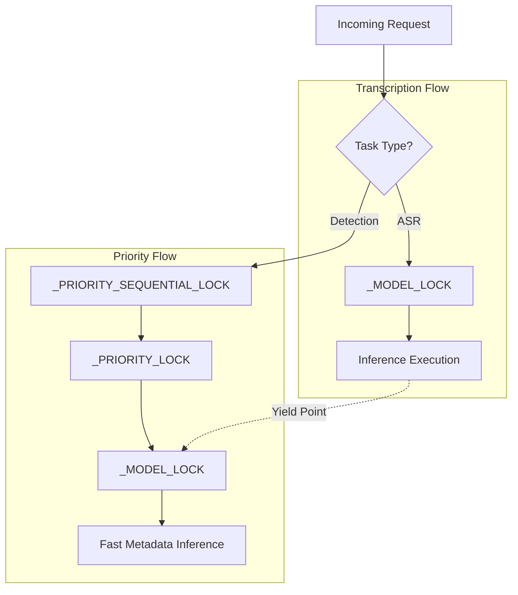
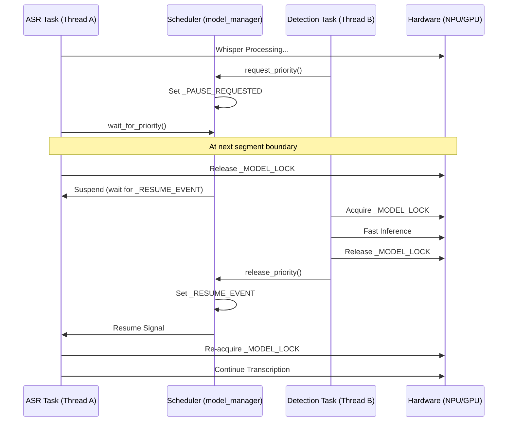
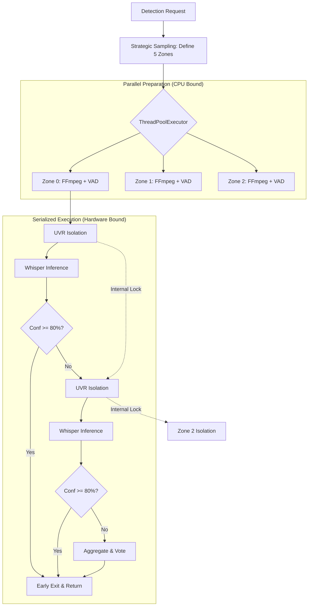
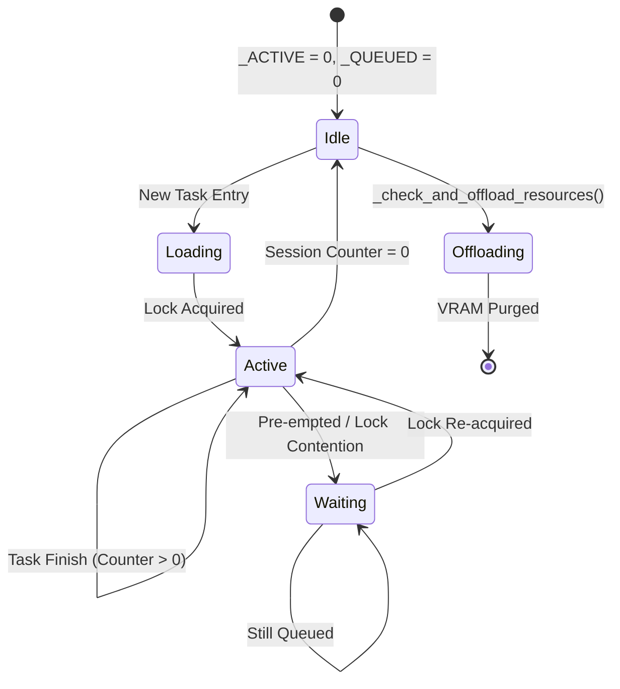

# Concurrency & Resource Orchestration

This document provides an exhaustive technical reference for the multithreading and resource management strategies implemented in **Whisper Pro ASR**. It is intended for developers and AI agents to understand the system's high-concurrency safeguards.

---

## 🏗 High-Level Architecture

Whisper Pro ASR uses a **Hybrid Concurrency Model** that balances I/O-bound tasks (FFmpeg extraction), CPU-bound tasks (Audio normalization), and Hardware-bound tasks (AI Inference).

### 1. The Locking Hierarchy
The system utilizes a multi-layered locking strategy to prevent race conditions and VRAM/NPU congestion:

| Lock Name | Type | Scope | Responsibility |
|:---|:---|:---|:---|
| `_MODEL_LOCK` | `threading.Lock` | Global | Ensures serial access to the Whisper Inference engine. |
| `_PRIORITY_LOCK` | `threading.Lock` | Global | Protects the priority request counter and pre-emption signal. |
| `_PRIORITY_SEQUENTIAL_LOCK` | `threading.RLock` | Global | Serializes multiple high-priority tasks (e.g., concurrent Detection calls). |
| `PreprocessingManager._lock` | `threading.Lock` | Instance | Serializes access to the UVR/MDX-NET isolation engine. |

### Resource Contention Visualization

---

## 🚦 Request Prioritization & Pre-emption

Whisper Pro implements a **Zero-Wait Detection** system that allows high-priority metadata tasks (Language Detection) to interrupt long-running transcriptions.

### The Yielding Workflow
1. **Priority Arrival**: A `/detect-language` request arrives and calls `model_manager.request_priority()`.
2. **Signal Broadcast**: The `_PAUSE_REQUESTED` event is set and `_RESUME_EVENT` is cleared.
3. **Yield Point**: The active Transcription thread checks for the pause signal at the end of every audio segment.
4. **Hardware Surrender**: The Transcription thread calls `wait_for_priority(model_lock=_MODEL_LOCK)`. It releases the Whisper engine lock and waits on `_RESUME_EVENT`.
5. **Priority Execution**: The Detection task acquires the locks, utilizes the hardware, and completes.
6. **Resumption**: The Detection task calls `release_priority()`, which sets `_RESUME_EVENT`. The Transcription thread re-acquires the lock and continues.

### Pre-emption Sequence Diagram

---

## 📦 Parallel Preprocessing Pipeline

While AI Inference is serialized to prevent hardware crashes, **Data Preparation** is highly parallelized.

### 1. Zone Extraction
In the `/detect-language` endpoint, the system uses a `ThreadPoolExecutor` (sized by `ASR_PREPROCESS_THREADS`) to extract and isolate up to 5 strategic audio zones concurrently.
- **FFmpeg**: Parallelized at the OS level (static builds).
- **UVR/Isolation**: Serialized via internal locks, but "Extraction" of zones happens in parallel while the UVR engine is busy with the previous zone.

### Detection Pipeline (Multi-Zone Voting)
The following diagram illustrates how the system balances high-throughput data preparation with serialized AI inference:

### 2. FFmpeg Threading
The `FFMPEG_THREADS` configuration limit is applied to every individual FFmpeg call to prevent "Fork Bombs" that could starve the primary Flask service.

---

## 🛠 Resource Lifecycle & Keep-Alive

To ensure production-grade stability, Whisper Pro implements **Unified Session Tracking**.

### 1. Tracking Counters
- `_ACTIVE_SESSIONS`: Tracks tasks currently inside a route or core execution function.
- `_QUEUED_SESSIONS`: Tracks tasks currently blocked by a hardware lock or waiting for pre-emption.

### 2. Proactive Reclamation
The system triggers `_check_and_offload_resources()` every time a session ends.
- **Rule**: Reclamation (VRAM/RAM clearing) ONLY happens if `Active + Queued == 0`.
- **Optimization**: If a second task is waiting in the queue, the model remains resident, avoiding the expensive "Initialization Penalty" (NPU compilation/VRAM allocation).

### Lifecycle State Machine

---

## 🧪 Concurrency Safeguards (Fail-Safe)

### Deadlock Prevention
- **Re-entrant Locks**: `_PRIORITY_SEQUENTIAL_LOCK` allows the same thread to acquire priority multiple times without locking itself.
- **Timeout Protection**: Internal `wait()` calls are balanced with state checks to ensure threads don't "hang" if a signal is missed.
- **Finally Blocks**: All lock acquisitions and session increments are wrapped in `try...finally` to ensure state balance even on catastrophic hardware failure.

### Hardware Isolation
The system distinguishes between **Isolation** (NPU/iGPU) and **Transcription** (CUDA/CPU). This "Split Architecture" allows UVR and Whisper to potentially run on different accelerators simultaneously, though internal locks still protect each specific resource from over-subscription.

---

## 📈 Configuration reference

| Variable | Target | Description |
|:---|:---|:---|
| `ASR_THREADS` | Whisper/PyTorch | Internal CPU threads for tensor operations. |
| `ASR_PREPROCESS_THREADS` | Parallel Pool | Number of concurrent FFmpeg extraction/isolation tasks. |
| `FFMPEG_THREADS` | FFmpeg Binary | Threads per extraction process. |
| `ASR_PARALLEL_LIMIT_ACCEL` | Global Queue | Maximum parallel requests allowed for hardware accelerators. |

---

> [!IMPORTANT]
> **Production Note**: Always ensure that `ASR_PREPROCESS_THREADS` * `FFMPEG_THREADS` does not exceed the physical core count of the host to maintain sub-second API responsiveness.
