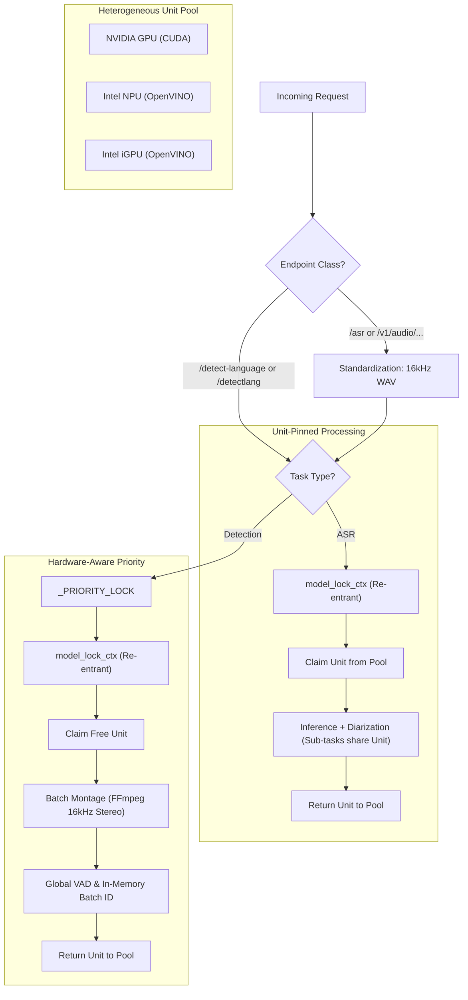

# Concurrency & Resource Orchestration

This document provides a technical reference for the multithreading and resource management strategies implemented in **Whisper Pro ASR**.

## Concurrency-First Contract

Concurrency correctness is Priority 1 for this project.

- The scheduler must avoid deadlock and livelock under normal operating assumptions.
- Synchronization waits in critical priority paths are intentionally unbounded to prevent timeout-driven request failures under load.
- Lock ordering must remain consistent and documented.
- Concurrency behavior changes require matching liveness tests and docs updates before merge.

### Global Lock Order

To avoid cyclic waits, use this order whenever more than one primitive is involved:

1. `STATE.task_order_lock`
2. `STATE.task_registry_lock`
3. `STATE.priority_lock`
4. `STATE.model_lock`
5. preprocessor and model-internal locks

If a call path cannot preserve this order, it must use immutable snapshots to avoid nested lock acquisition.

---

## 🏗 Heterogeneous Model Pooling

Whisper Pro uses a **Hardware Resource Pool** to balance I/O-bound tasks, CPU-bound tasks, and multi-silicon AI inference.

### 1. The Locking Hierarchy

| Lock Name | Type | Scope | Responsibility |
|:---|:---|:---|:---|
| `STATE.model_lock` | `threading.Semaphore` | Global | Governs total parallel tasks based on physical hardware units. |
| `STATE.hw_pool` | `queue.Queue` | Global | Holds specific hardware IDs (e.g. `GPU.0`, `NPU.0`) for task assignment. |
| `model_lock_ctx` | **Re-entrant Lock** | Thread-Local | Allows nested sub-tasks (UVR → ASR → Diarization) to share the same hardware claim. |
| `STATE.priority_lock` | `threading.Lock` | Global | Protects priority counters and pre-emption signals. |
| `_POOL_LOCK` | `threading.Lock` | Global | Serializes model loading and unloading operations to prevent race conditions during engine state transitions. |

### Indefinite Wait Policy

- Unit pause confirmation waits remain active until the expected unit generation token is confirmed.
- Unit resume waits remain active until the targeted hardware unit is resumed.
- Hardware acquisition loops remain queued until a unit becomes available.
- Liveness is protected by cooperative yielding and regression tests, not timeout exceptions.

### Resource Orchestration Flow

---

## 🚦 Request Prioritization & Pre-emption

Whisper Pro implements a **Zero-Wait Detection** system that allows high-priority tasks to interrupt batch transcriptions only when the hardware is fully saturated.

### The Yielding Workflow
1. **Priority Arrival**: A high-priority `/detect-language` (or `/detectlang`) request enters the system.
2. **Hardware Check**: If any unit in the `_HW_POOL` is idle, it is claimed via `model_lock_ctx` and the task proceeds.
3. **Saturation Signal**: If all units are busy, the scheduler marks a targeted hardware unit as paused in `STATE.unit_sync[unit_id]`.
4. **Cooperative Yield**: The active transcription thread owning that unit checks the unit pause event at yield boundaries, releases its claimed hardware unit, confirms pause for the matching generation token, and waits on that same unit's resume event.
5. **Priority Execution**: The priority task claims the now-free unit and executes its batch montage pipeline.
6. **Automated Resumption**: Once the priority task completes, the `release_priority()` function is called (integrated into the `early_task_registration` cleanup). This clears the targeted unit pause request and sets that unit's resume event. The transcription thread re-acquires its unit and continues exactly where it left off.

> [!NOTE]
> **Current Priority Yielding Behavior**:
> - **Parallel Priority Capacity**: Priority tasks are not globally serialized; concurrent detect-language requests can run in parallel across multiple available/borrowed units.
> - **Standard Task Yielding**: Standard tasks yield resource acquisition and loop-sleep instead of blocking on the model lock semaphore whenever priority tasks are present in the registry, preventing priority starvation.
> - **Priority Preemption Bypass**: Running priority tasks ignore preemption requests, preventing them from pausing themselves if multiple priority tasks are queued.
> - **Preemption Visibility**: Preempted tasks temporarily transition to `"queued"` status with a `"Paused for Priority Task"` stage, ensuring they display in the dashboard queue.
> - **Unit-Only Gating Rule**: All pause/resume synchronization that affects execution is bound to `STATE.unit_sync[unit_id]`; shared events are compatibility mirrors only and must not gate execution.
>
> **FIFO Within Priority Tier (Current Scheduler Semantics)**:
> - **Arrival Tracking**: The scheduler records per-task arrival timestamps (`task_arrival_order`) at early registration.
> - **Same-Tier FIFO**: Resource acquisition blocks only when an earlier task of the same priority tier is still waiting for hardware.
> - **No False Blocking**: Earlier tasks already running on a unit do not block later same-tier tasks from taking other available units.
> - **Priority Preserved**: Detect-language (priority) tasks are never blocked by earlier standard ASR tasks.
> - **Alias Equivalence**: `/detect-language` and `/detectlang` are treated identically by scheduler priority logic.
>
> **FFmpeg Coordination Note**:
> - `wait_for_priority()` does not block on shared FFmpeg drain counters.
> - **Scope**: Preemption decisions are based on hardware saturation, unit ownership, and unit-scoped pause/resume generation tokens.
>
> **Current ASR Route Checkpoints**:
> - **Pre-Vocal-Separation Yield**: `/asr` performs a cooperative `_check_preemption()` immediately after language detection.
> - **Pre-Inference Yield**: `/asr` performs a second cooperative `_check_preemption()` immediately before `run_transcription(...)` starts inference work.
> - **HQ-Prep FFmpeg Yield**: During `prepare_for_uvr(...)`, FFmpeg progress updates trigger cooperative yield callbacks at stage increments so priority tasks do not wait for full HQ preparation to finish.
> - **Goal**: Priority detect-language tasks can preempt both before expensive preprocessing and right before inference execution begins.
>
> **Stage-Transition Yielding (ASR Runtime)**:
> - The ASR flow performs cooperative `_check_preemption()` checks at stage boundaries (`Initializing`, `Language Detection`, `Vocal Separation`, `Inference`, and final completion update).
> - This ensures priority work can preempt on stage changes, not only during long-running inner loops.

---

## 📦 High-Performance Batch Detection
 
While AI Inference is serialized per hardware unit, **Data Preparation** for language detection is optimized through a single-pass montage pipeline.
 
### 1. Consolidated Execution
In the `/detect-language` endpoint, the system uses a **Global VAD + In-Memory Slicing** strategy:
- **Montage Creation**: A single FFmpeg command extracts zone samples into one file.
- **Single-Pass Isolation**: UVR Separation is performed ONCE on the entire montage.
- **Global VAD Scan**: A single VAD pass identifies speech regions across all segments in memory.
- **In-Memory Slicing**: segments are sliced as NumPy arrays, avoiding any temporary file I/O for individual probes.
  
### 2. Efficiency Gains
By consolidating up to 15 probes into a single processing pass:
- **Latency**: Reduced by up to 85% compared to sequential processing.
- **VAD Optimization**: Redundant VAD scans are eliminated. The inference engine processes raw audio segments only where the Global VAD has already confirmed speech presence.
- **Hardware Stability**: Prevents context-switching thrashing and ensures the accelerator (NPU/GPU) remains at peak utilization.

---

## 🛠 Resource Lifecycle & Keep-Alive

### 1. Session Tracking
- `_ACTIVE_SESSIONS`: Tasks currently in core execution.
- `_QUEUED_SESSIONS`: Tasks waiting for hardware availability.

### 2. Model Idle Timeout
The service supports a configurable **Model Idle Timeout** as an alternative to aggressive offloading:

| Variable | Default | Behavior |
|:---|:---|:---|
| `AGGRESSIVE_OFFLOAD` | `false` | Immediately unload all models when active sessions reach zero. |
| `MODEL_IDLE_TIMEOUT` | `300` | A deferred `threading.Timer` is started after the last task completes. Models are only purged after the configured number of seconds with zero active sessions. New incoming tasks cancel and reschedule the timer. |

When `MODEL_IDLE_TIMEOUT > 0` (or defaults to `300`), it takes precedence over `AGGRESSIVE_OFFLOAD`. This allows models to remain warm in memory for rapid response to subsequent requests within the timeout window. If a new task arrives while the cleanup routine is actively executing (not just waiting for the timer), the system allows the cleanup to complete and re-initializes models on demand for the new task.

### 3. Storage & Memory Hygiene
The service implements a **Centralized Storage Hygiene** strategy. Every transient file created during a request (uploads, HQ prep files, isolated stems) is registered in a thread-local `tracked_files` registry. A mandatory `cleanup_files()` call in the request's `finally` block ensures 100% reclamation of storage space.

### 4. Dashboard Ordering Contract
- Active and history entries are sorted by task arrival/start time (`start_time`) to preserve operator-visible execution chronology.
- This ordering is deterministic and independent of map/dict iteration order.

### 5. CPU Constraint Enforcement
On hardware with very limited resources (e.g., 1-CPU systems), the service automatically wraps **all** AI inference (including Whisper and UVR) in the `_CPU_LOCK`. This prevents the "thundering herd" problem where multiple AI engines attempt to over-utilize the same single CPU core, which previously caused significant latency spikes and high memory overhead.

> [!IMPORTANT]
> **Hardware Enforcement**: The service automatically resolves and enforces thread limits based on your host's physical silicon. User-provided `ASR_THREADS` in `docker-compose.yml` are treated as maximums, not guarantees.

---

## 🗣 Speaker Diarization Concurrency

When `diarize=true` is passed to `/asr`, the diarization pipeline runs **within the same re-entrant hardware lock context** as the main transcription. This ensures:
- **No additional hardware claims**: Alignment and diarization share the unit already claimed for transcription.
- **Cache isolation**: Each hardware unit maintains its own `_ALIGN_POOL` and `_DIARIZE_POOL` entries, preventing cross-unit cache collisions.
- **Preemption safety**: Diarization stages respect the same `_check_preemption()` cooperative yielding checks as transcription.
- **Graceful fallback**: If diarization fails (missing `HF_TOKEN`, model download failure, etc.), the system returns non-diarized transcription results without raising an error to the client.
