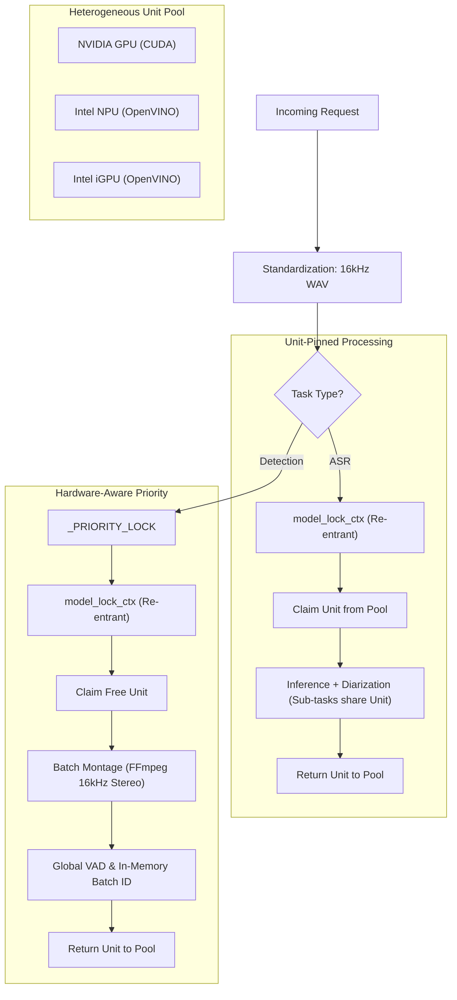

# Concurrency & Resource Orchestration

This document provides a technical reference for the multithreading and resource management strategies implemented in **Whisper Pro ASR**.

---

## 🏗 Heterogeneous Model Pooling

Whisper Pro uses a **Hardware Resource Pool** to balance I/O-bound tasks, CPU-bound tasks, and multi-silicon AI inference.

### 1. The Locking Hierarchy

| Lock Name | Type | Scope | Responsibility |
|:---|:---|:---|:---|
| `STATE.model_lock` | `threading.Semaphore` | Global | Governs total parallel tasks based on physical hardware units. |
| `STATE.hw_pool` | `queue.Queue` | Global | Holds specific hardware IDs (e.g. `GPU.0`, `NPU.0`) for task assignment. |
| `STATE.priority_sequential_lock` | `threading.Semaphore` | Global | Prevents CPU thrashing by governing heavy non-accelerated tasks. |
| `model_lock_ctx` | **Re-entrant Lock** | Thread-Local | Allows nested sub-tasks (UVR → ASR → Diarization) to share the same hardware claim. |
| `STATE.priority_lock` | `threading.Lock` | Global | Protects priority counters and pre-emption signals. |
| `_POOL_LOCK` | `threading.Lock` | Global | Serializes model loading and unloading operations to prevent race conditions during engine state transitions. |

### Resource Orchestration Flow

---

## 🚦 Request Prioritization & Pre-emption

Whisper Pro implements a **Zero-Wait Detection** system that allows high-priority tasks to interrupt batch transcriptions only when the hardware is fully saturated.

### The Yielding Workflow
1. **Priority Arrival**: A high-priority `/detect-language` request enters the system.
2. **Hardware Check**: If any unit in the `_HW_POOL` is idle, it is claimed via `model_lock_ctx` and the task proceeds.
3. **Saturation Signal**: If all units are busy, the global `STATE.pause_requested` event is triggered.
4. **Cooperative Yield**: Active transcription threads check this event at segment boundaries. They release their claimed hardware units, confirm the pause (`STATE.pause_confirmed`), and wait.
5. **Priority Execution**: The priority task claims the now-free unit and executes its batch montage pipeline.
6. **Automated Resumption**: Once the priority task completes, the `release_priority()` function is called (integrated into the `early_task_registration` cleanup). This clears the `pause_requested` state and sets the `resume_event`. The transcription threads re-acquire their units and continue exactly where they left off.

> [!NOTE]
> **v1.0.6 Strict Priority Serialization & Yielding**:
> - **Strict Priority Serialization**: The `STATE.priority_sequential_lock` is held for the entire context lifetime of `early_task_registration`. This ensures that concurrent priority requests are scheduled and executed sequentially, preventing race conditions that could lead to double-preemption and deadlocking standard tasks in a permanent paused state.
> - **Standard Task Yielding**: Standard tasks yield resource acquisition and loop-sleep instead of blocking on the model lock semaphore whenever priority tasks are present in the registry, preventing priority starvation.
> - **Priority Preemption Bypass**: Running priority tasks ignore preemption requests, preventing them from pausing themselves if multiple priority tasks are queued.
> - **Preemption Visibility**: Preempted tasks temporarily transition to `"queued"` status with a `"Paused for Priority Task"` stage, ensuring they display in the dashboard queue.
>
> **v1.1.0 FFmpeg Standardization Synchronization**:
> - **Active FFmpeg Tracking**: Standard tasks track active FFmpeg processes via a public condition variable and count state (`STANDARD_FFMPEG_COND` and `STANDARD_FFMPEG_STATE`).
> - **Priority Yielding to FFmpeg**: Incoming high-priority requests (like `/detect-language`) dynamically block inside `wait_for_priority()` if a standard task is performing CPU-heavy FFmpeg standardization, preventing CPU over-subscription.
> - **Dynamic Handoff**: The priority task starts immediately after the standard task's FFmpeg phase completes.
> - **Model Lock Pre-emption**: When the standard `/asr` task finishes FFmpeg and attempts to proceed to vocal separation or inference, it will block on `model_lock_ctx` and yield to the active priority task, resuming only after the priority task finishes.

---

## 📦 High-Performance Batch Detection
 
While AI Inference is serialized per hardware unit, **Data Preparation** for language detection is optimized through a single-pass montage pipeline.
 
### 1. Consolidated Execution
In the `/detect-language` endpoint, the system uses a **Global VAD + In-Memory Slicing** strategy:
- **Montage Creation**: A single FFmpeg command extracts zone samples into one file.
- **Single-Pass Isolation**: UVR Separation is performed ONCE on the entire montage.
- **Global VAD Scan**: A single VAD pass identifies speech regions across all segments in memory.
- **In-Memory Slicing**: segments are sliced as NumPy arrays, avoiding any temporary file I/O for individual probes.
  
### 2. Efficiency Gains
By consolidating up to 15 probes into a single processing pass:
- **Latency**: Reduced by up to 85% compared to sequential processing.
- **VAD Optimization**: Redundant VAD scans are eliminated. The inference engine processes raw audio segments only where the Global VAD has already confirmed speech presence.
- **Hardware Stability**: Prevents context-switching thrashing and ensures the accelerator (NPU/GPU) remains at peak utilization.

---

## 🛠 Resource Lifecycle & Keep-Alive

### 1. Session Tracking
- `_ACTIVE_SESSIONS`: Tasks currently in core execution.
- `_QUEUED_SESSIONS`: Tasks waiting for hardware availability.

### 2. Model Idle Timeout
The service supports a configurable **Model Idle Timeout** as an alternative to aggressive offloading:

| Variable | Default | Behavior |
|:---|:---|:---|
| `AGGRESSIVE_OFFLOAD` | `false` | Immediately unload all models when active sessions reach zero. |
| `MODEL_IDLE_TIMEOUT` | `300` | A deferred `threading.Timer` is started after the last task completes. Models are only purged after the configured number of seconds with zero active sessions. New incoming tasks cancel and reschedule the timer. |

When `MODEL_IDLE_TIMEOUT > 0` (or defaults to `300`), it takes precedence over `AGGRESSIVE_OFFLOAD`. This allows models to remain warm in memory for rapid response to subsequent requests within the timeout window. If a new task arrives while the cleanup routine is actively executing (not just waiting for the timer), the system allows the cleanup to complete and re-initializes models on demand for the new task.

### 3. Storage & Memory Hygiene
The service implements a **Centralized Storage Hygiene** strategy. Every transient file created during a request (uploads, HQ prep files, isolated stems) is registered in a thread-local `tracked_files` registry. A mandatory `cleanup_files()` call in the request's `finally` block ensures 100% reclamation of storage space.

### 4. CPU Constraint Enforcement
On hardware with very limited resources (e.g., 1-CPU systems), the service automatically wraps **all** AI inference (including Whisper and UVR) in the `_CPU_LOCK`. This prevents the "thundering herd" problem where multiple AI engines attempt to over-utilize the same single CPU core, which previously caused significant latency spikes and high memory overhead.

> [!IMPORTANT]
> **Hardware Enforcement**: The service automatically resolves and enforces thread limits based on your host's physical silicon. User-provided `ASR_THREADS` in `docker-compose.yml` are treated as maximums, not guarantees.

---

## 🗣 Speaker Diarization Concurrency

When `diarize=true` is passed to `/asr`, the diarization pipeline runs **within the same re-entrant hardware lock context** as the main transcription. This ensures:
- **No additional hardware claims**: Alignment and diarization share the unit already claimed for transcription.
- **Cache isolation**: Each hardware unit maintains its own `_ALIGN_POOL` and `_DIARIZE_POOL` entries, preventing cross-unit cache collisions.
- **Preemption safety**: Diarization stages respect the same `_check_preemption()` cooperative yielding checks as transcription.
- **Graceful fallback**: If diarization fails (missing `HF_TOKEN`, model download failure, etc.), the system returns non-diarized transcription results without raising an error to the client.
